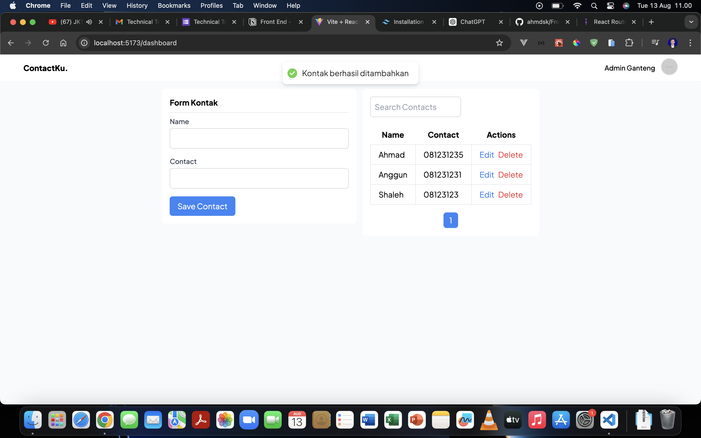
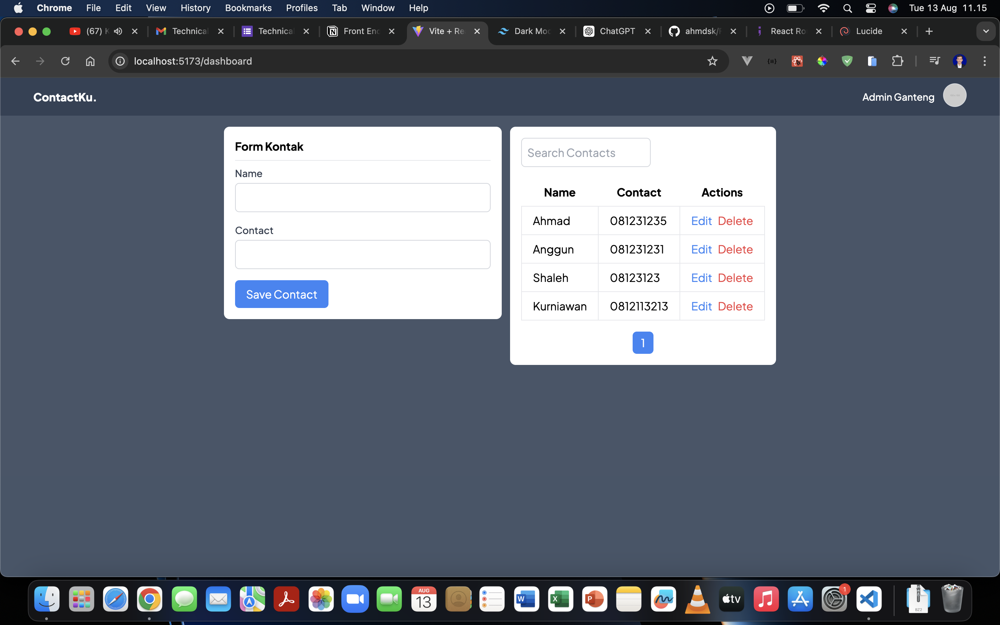
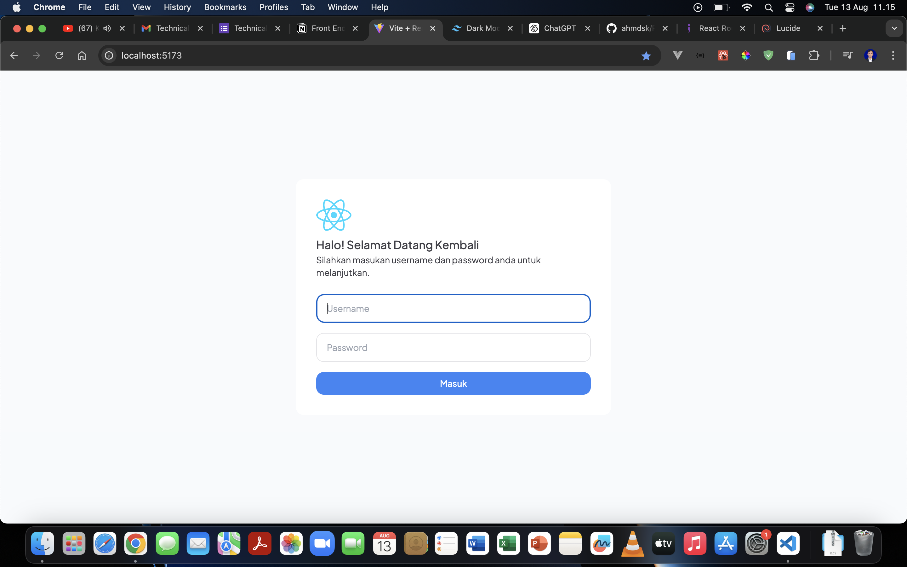

## Frontend Test Aksamedia

Paduan Download dan Install Dependensi yang dibbutuhkan dengan cara dibawah

```sh
git clone https://github.com/ahmdsk/FrontendTestAksamedia
cd FrontendTestAksamedia
npm install
npm run dev
```

Setelah itu local server akan berjalan di port 5173
http://localhost:5173

### Screenshoot




